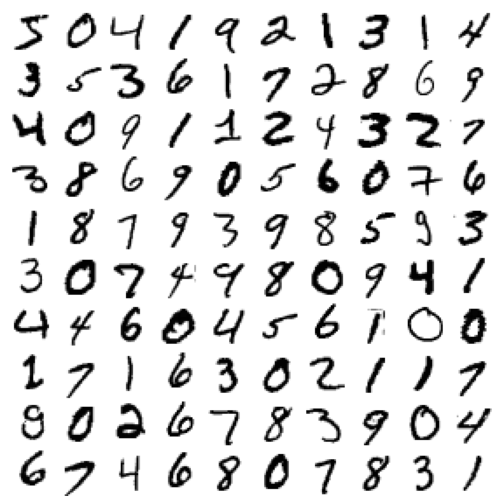
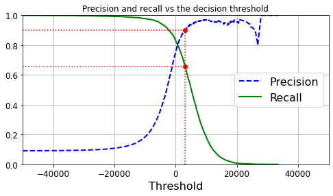
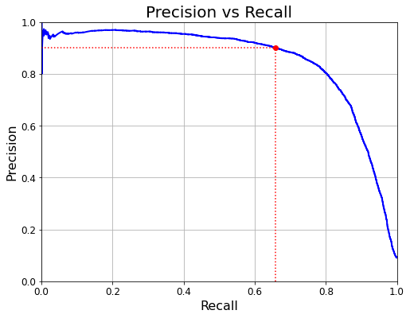
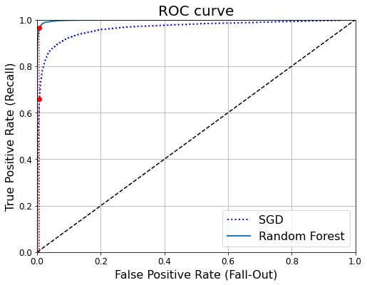

# Hands-on-ML-Chapter-3---Classification

## Description:

[The summary of Chapter 3](https://github.com/buddhika159/Hands-on-ML-Chapter-3---Classification/blob/d7fe2cc276fbf3243ba32319d9bed776da33e8be/MNIST-dataset-classification.ipynb)
This repository includes the classification techeniqes discussed in the book [Hands-On Machine Learning with Scikit-Learn and TensorFlow](https://www.knowledgeisle.com/wp-content/uploads/2019/12/2-Aur%C3%A9lien-G%C3%A9ron-Hands-On-Machine-Learning-with-Scikit-Learn-Keras-and-Tensorflow_-Concepts-Tools-and-Techniques-to-Build-Intelligent-Systems-O%E2%80%99Reilly-Media-2019.pdf) chapter 3. It uses the MNIST dataset containing `70,000` images of handwritten digits. 

  

All the classification methods that this chapter discusses can mainly be categorizes as:
 - Binary Classifiers (digit is `5` or `not 5`)
    - Stochastic Gradient Descent Classifier `SGDClassifier` 
       - CV accuracy = `96%` 
       - Precision = `75.5%` 
       - Recall = `83%` 
       - F1 score = `79%`
    - This also discusses about the Precision Recall Trade-off with the following plots

    - Base Estimator (Dumb Classifier)  with `91%` CV accuracy
    - Random Forest Classifier `RandomForestClassifier`
       - Precision = `99%`
       - Recall = `87.3%`
       - AUC score = `99.8%`
    - SGD and Random Forest Classifiers are then comparied using the ROC curve

  
   

  

 - Multiclass Classifiers
    - Using Binary Classifiers for Multiclass
       - Most Binary Classifiers (like Linear classifiers) uses One-vs-All strategy in `Scikit-Learn`
       - Support Vector Machine classifiers `SVC`
          - `Scikit-Learn` uses One-vs-One strategy for this because it is much faster
      
    - `SGDClassifier` (or can use `RandomForestClassifier`, `Naive Bayes classifier`)
       - CV accuracy = `88.5%` 
       - Simply standardizing the dataset using `StandardScaler`, it increases the CV accuracy to `89.5%`
       - Analyzing the confusion matrices below, we see that SGD is misclassifying the digit `8` alot, but not all the time.

  
   

 - Multilabel Classification
    - Classifiers to output multiple classes for each instance.
    - Example: face-recognition classifier recognizes several people on the same picture.
    - K-nearest neighbors Classifier `KNeighborsClassifier(n_neighbors = 5)`
       - Has two target labels:
          - digit >=7 or not
          - digit is odd or not
       - Average of F1 score for each label is `97.6%`
    - `KNeighborsClassifier(n_neighbors = 4)` targets beeing the `10` classes
       - Test accuracy = `97.1%`
       - After concatenate shifted digits, Test accuracy = `97.6%`

  
   

 - Multioutput-multiclass Classification
    - Multilabel classification where each label can be multiclass
    - Example: Denoise a noisy digits (pixels are the labels and each pixel can be `0` to `255`)
 	- `KNeighborsClassifier` is used here.

[Exercise 1](https://github.com/buddhika159/Hands-on-ML-Chapter-3---Classification/blob/d7fe2cc276fbf3243ba32319d9bed776da33e8be/Exercise%201%20MNIST%20Classifier%20With%20Over%2097%25%20Accuracy.ipynb) 
This constructs a `97%` accurate classifier for the MNIST dataset
 - Classifier is `KNeighborsClassifier` and it uses `GridSearchCV` method to tune hyperparameters `weights` and `n_neighbors`
 - `grid_search.best_params_ = {'n_neighbors': 4, 'weights': 'distance'}`

  

[Exercise 2](https://github.com/buddhika159/Hands-on-ML-Chapter-3---Classification/blob/d7fe2cc276fbf3243ba32319d9bed776da33e8be/Exercise%202%20Data%20Augmentation.ipynb)
This again shows a way to increase the accuracy of a classifier for the MNIST dataset by data augmentation.
 - KNeighborsClassifier(n_neighbors = 4)
 - Test accuracy = `97.6%`

  
  

[Exercise 3](https://github.com/buddhika159/Hands-on-ML-Chapter-3---Classification/blob/d7fe2cc276fbf3243ba32319d9bed776da33e8be/Exercise%203%20Titanic%20dataset.ipynb)
Tackle the Titanic dataset

[Exercise 4](https://github.com/buddhika159/Hands-on-ML-Chapter-3---Classification/blob/d7fe2cc276fbf3243ba32319d9bed776da33e8be/Exercise%204%20Spam%20classifier.ipynb)
Spam classifier

## Prerequisites:
Below libraries are needed to execute this Python code.
- Python 3.9
- NumPy
- Matplotlib

